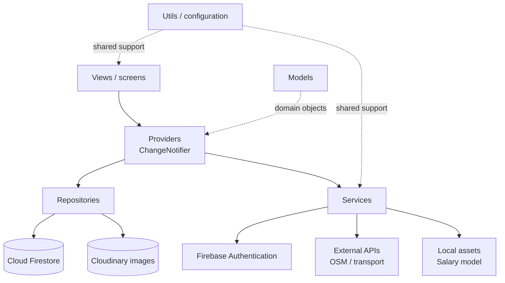
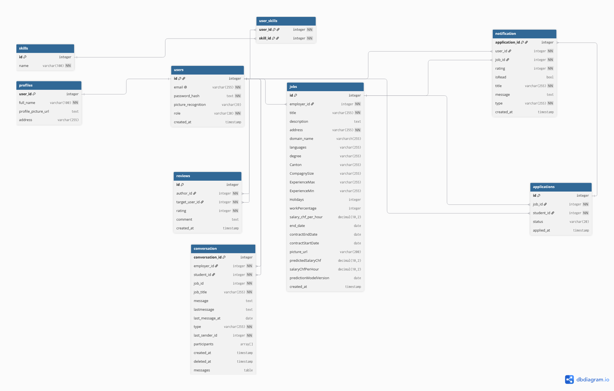
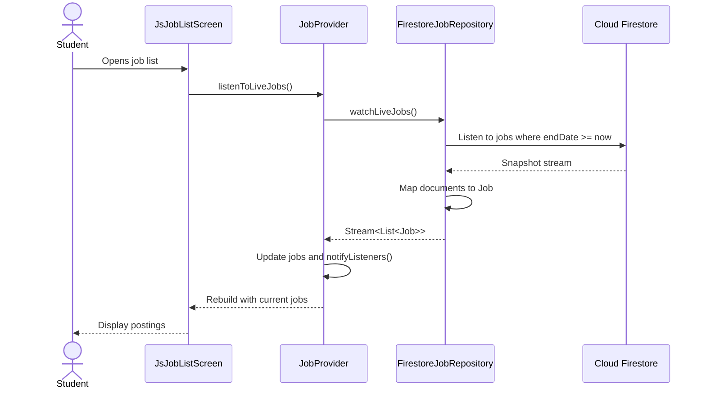
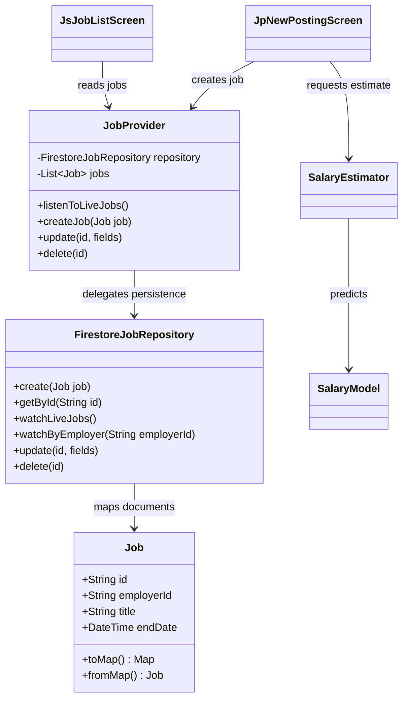

# TafMatch

TafMatch is a Flutter application that connects students looking for jobs with
enterprises looking for employees. Students can create a profile, browse and
apply for job postings, communicate with employers, and use location and salary
features. Employers can publish postings and manage applications. Administrators
can access the administration dashboard.


### Architecture

TafMatch uses a layered Flutter architecture with dependency injection through
Provider:



Responsibilities are deliberately separated:

| Layer | Responsibility | Main location |
| --- | --- | --- |
| Application entry point | Initializes dotenv, Firebase, the model, and Provider dependencies | `lib/main.dart` |
| Views | Displays screens and forwards user actions to providers | `lib/views/` |
| Providers | Holds presentation state, subscribes to streams, and exposes use cases to views | `lib/providers/` |
| Repositories | Reads and writes persistent or remote data behind a feature-specific API | `lib/repositories/` |
| Services | Encapsulates authentication, camera, address lookup, and salary estimation | `lib/services/` |
| Models | Converts domain objects to and from Firestore-compatible data | `lib/models/` |
| Utils | Shared constants, theme, Firebase configuration, notifications, and API helpers | `lib/utils/` |

### Database structure

Firestore is a NoSQL database. The following diagram describes the logical
structure used by the application; the actual security rules remain the source
of truth for access control.



The principal collections are:

| Collection | Application model / purpose |
| --- | --- |
| `users` | `User`: student, employer, or administrator profile |
| `jobs` | `Job`: job posting, contract details, location, languages, and salary data |
| `applications` | `Application`: relationship between a student and a job posting |
| `skills` | `Skill`: reusable skills associated with users or profiles |
| `workExperiences` | `WorkExperience`: professional experience in a user profile |
| `reviews` | `Review`: feedback related to a user or completed interaction |
| `conversations` | `Conversation`: chat participants and conversation metadata |
| `messages` | `Message`: messages belonging to a conversation |
| `notifications` | `Notification`: notifications addressed to a user |

Repositories map these collections into Dart models. For example,
`FirestoreJobRepository` watches live jobs with a Firestore stream, converts
documents with `Job.fromMap`, and exposes `Job` objects to `JobProvider`.

### Data flow analysis

The following flow shows the main read path for a student browsing current job
postings:



The main write path follows the reverse direction: a screen collects form
values, a provider delegates the operation, the repository serializes the
model with `toMap()`, and Firestore persists it. Firestore streams then update
interested screens without requiring a manual refresh.

Other data flows are kept outside Firestore where appropriate:

- Firebase Authentication handles identity; `FirebaseAuthService` exposes the
  authentication operations to `AuthProvider`.
- Images are uploaded through `CloudinaryImageRepository`; only the resulting
  URL is stored in a model such as `Job`.
- The salary predictor loads `assets/salary_model.json` locally. `SalaryEstimator`
  transforms form values into the model's expected features and returns an
  estimate without sending those values to a remote service.
- Address and transport helpers call external location or transport APIs and
  return data to the relevant screen or service.

### UML class diagram

This class diagram documents the central job-posting path and its dependencies.
It is intentionally focused on the ownership relationships that are useful
when adding a feature.



### Feature-to-file map

| Feature | Screens | State / data | Integration |
| --- | --- | --- | --- |
| Authentication and profiles | `login_screen.dart`, `signup_screen.dart`, `profile_screen.dart` | `auth_provider.dart`, `user_provider.dart`, `user_model.dart` | `firebase_auth_service.dart`, `firestore_user_repository.dart` |
| Job postings | `js_job_list_screen.dart`, `js_job_details_screen.dart`, `jp_new_posting_screen.dart`, `jp_my_posting_screen.dart` | `job_provider.dart`, `job_model.dart` | `firestore_job_repository.dart` |
| Applications | `js_applications_screen.dart`, `jp_applicants_screen.dart` | `application_provider.dart`, `application_model.dart` | `firestore_application_repository.dart` |
| Messaging | `chat_list_screen.dart`, `chat_screen.dart` | `chat_provider.dart`, `conversation_model.dart`, `message_model.dart` | `firestore_chat_repository.dart` |
| Skills and experience | `edit_profile_screen.dart` | `skill_provider.dart`, `work_experience_provider.dart` | Corresponding Firestore repositories |
| Reviews and notifications | `profile_screen.dart`, notification UI | `review_provider.dart`, `notification_provider.dart` | Firestore repositories and Firebase Messaging |
| Location | Job and profile forms | `location_utils.dart`, `address_lookup.dart` | `geolocator`, OSM, and transport API helpers |
| Salary estimation | `jp_new_posting_screen.dart` | `salary_estimator.dart`, `salary_model.dart` | `assets/salary_model.json` |

### Technologies and versions

Versions below are the constraints declared in `pubspec.yaml`. A caret (`^`)
allows compatible updates when dependencies are resolved; run `flutter pub get`
to resolve the exact versions in the local lockfile.

| Technology / library | Version constraint | Usage |
| --- | --- | --- |
| Dart SDK | `>=3.4.1 <4.0.0` | Language and runtime constraint |
| Flutter | SDK dependency | Cross-platform UI framework |
| Firebase Core | `^4.0.0` | Firebase initialization |
| Firebase Auth | `^6.0.0` | User authentication |
| Cloud Firestore | `^6.0.0` | NoSQL persistence and realtime streams |
| Firebase Messaging | `^16.6.0` | Push notifications |
| Provider | `^6.1.2` | Dependency injection and presentation state |
| HTTP | `^1.2.2` | HTTP API calls |
| Image Picker | `^1.1.2` | Selecting images from the device |
| Map packages | `flutter_map ^8.3.2`, `latlong2 ^0.10.1`, `flutter_osm_plugin ^2.0.1+1` | Maps and coordinates |
| Geolocator | `^14.0.3` | Device location |
| Camera and face detection | `camera ^0.12.0+2`, `face_detection_tflite ^6.8.0` | Face login and camera access |
| Local notifications | `^22.3.0` | On-device notifications |
| Internationalization | `intl ^0.20.3` | Date and number formatting |
| Environment configuration | `flutter_dotenv ^5.1.0` | Loading local environment values |
| Testing | `flutter_test`, `mockito ^5.7.0`, `fake_cloud_firestore ^4.2.0` | Widget, unit, mock, and Firestore tests |
| Test code generation | `build_runner ^2.15.1` | Mockito mock generation |
| Linting | `flutter_lints ^6.0.0` | Dart and Flutter lint rules |

The Android, iOS, web, Windows, Linux, and macOS folders contain platform
integration generated or maintained by Flutter. Platform-specific permissions,
Firebase configuration, and notification setup must be updated when adding a
platform-dependent feature.

## LLM Usage

LLM prompting had been used on differents level by different group members.

- Frontend : Designing the pages to make them like mockups (the logic hasn't been touch).
- Data analytics Model : architecture and knowledge for the salary model.
- Code : Generation of comments and cleaning code, assistant for designing backend when needed, creation of unit tests and debug.


## Development

### Install and run

1. Install Flutter and configure an Android SDK if Android development is
   required. Check the environment with:

   ```text
   flutter doctor --verbose
   ```

2. Install dependencies and run the app:

   ```text
   flutter pub get
   flutter run
   ```

3. Configure the local `.env` file and Firebase platform configuration before
   using features that require credentials. Do not commit secrets.

### Tests

Test files must end in `_test.dart` and live in `test/`.

Run all tests:

```text
flutter test
```

Run one test file:

```text
flutter test test/<path_to_the_file>/<file_name>_test.dart
```

Show `print` output:

```text
flutter test --reporter=expanded
```

Some widget tests use Mockito. Generated `.mocks.dart` files are created or
updated with:

```text
dart run build_runner build
```

Generated mock files should not be edited manually.

### Firestore rules

After changing `firestore.rules`, deploy the rules with:

```text
firebase deploy --only firestore:rules --project taf-match
```

### Android release build

Install Android Studio and the required Android SDK, Build Tools, NDK,
command-line tools, CMake, emulator, and platform tools. If Flutter cannot
find the correct JDK, configure it with:

```text
flutter config --jdk-dir="<full path to the JDK folder>"
```

Create a release keystore and keep its credentials in a local `key.properties`
file that is excluded from Git. Then build the release bundle:

```text
flutter clean
flutter pub get
flutter build appbundle --release --build-number=<build number>
```

The Android package name must match the package registered in Google Play and
the Firebase configuration files.